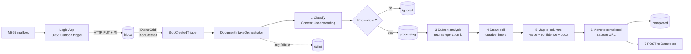

# Document Intake

Email attachments arrive in an M365 mailbox, get classified and OCR'd by Azure AI Foundry
Content Understanding, mapped onto a known form's columns, and pushed to Dataverse — with the
file moving through blob containers that reflect its lifecycle state.

## Architecture



Every Azure-to-Azure hop uses a **system-assigned managed identity**: Function App → Storage,
Function App → Foundry, Logic App → Storage, and Foundry → Storage (so the analyzer can read
the blob URL it is handed). No connection strings or account keys appear in app settings.

## Containers

| Container    | Meaning |
| ------------ | ------- |
| `inbox`      | Landing zone written by the Logic App. Event Grid watches this one. |
| `processing` | Classified as a known form; analysis in flight. |
| `ignored`    | Not a known form (or below the classification confidence threshold). |
| `completed`  | Successfully processed; the URL is captured into the Dataverse payload. |
| `failed`     | Any orchestration failure. `intakeReason` blob metadata explains why. |

Moves are copy-then-delete (`StartCopyFromUri` → poll → delete), so a crash mid-move can never
lose a file. `BlobRouter.MoveAsync` treats "source gone, destination present" as success, which
makes retries idempotent.

## Repo layout

```
infra/                    Bicep, azd-conventional
  main.bicep              subscription scope; creates rg-<env> and wires the modules
  core/                   storage, monitoring, foundry, functionapp, logicapp, eventgrid, rbac
src/DocumentIntake.Functions
  Triggers/               Event Grid entry point
  Orchestrations/         the durable orchestrator + polling schedule
  Activities/             classify, move, submit, poll, map, post
  Services/               Content Understanding, blob routing, field mapping, Dataverse
analyzers/contentunderstanding
  document-intake-classifier.json       classifier definition
  document-intake-form-analyzer.json    field schema for the known form
  field-map.json                        analyzer field name -> Dataverse column
scripts/register-analyzers.ps1          PUTs both definitions after provisioning
src/DocumentIntake.Tests                xUnit
```

## Deploy

```powershell
azd auth login
azd up
```

`azd up` provisions everything and then runs `scripts/register-analyzers.ps1` as a postprovision
hook to register the classifier and analyzer against the new Foundry endpoint.

Two steps still need a human — see [docs/manual-setup.md](docs/manual-setup.md):

1. Authorize the Office 365 API connection (interactive OAuth consent).
2. Decide and configure Dataverse authentication, then set `Dataverse__Enabled=true`.

## Configuration

Set as app settings by `infra/core/functionapp.bicep`; mirror them in `local.settings.json`
(copy `local.settings.json.sample`) when running locally.

| Setting | Purpose |
| ------- | ------- |
| `Storage__BlobServiceUri` | Blob endpoint used by `BlobRouter`. |
| `AzureWebJobsStorage__blobServiceUri` / `__queueServiceUri` / `__tableServiceUri` | Identity-based host storage (Durable Functions needs all three). |
| `ContentUnderstanding__Endpoint` | Foundry account endpoint. |
| `ContentUnderstanding__ApiVersion` | Pinned API version (`2025-11-01`). |
| `ContentUnderstanding__ClassifierId` | Classifier to call in step 1. |
| `ContentUnderstanding__AnalyzerId` | Analyzer to call in step 3. |
| `ContentUnderstanding__KnownFormCategory` | Category treated as a known form (default `known-form`). |
| `ContentUnderstanding__MinimumClassificationConfidence` | Below this, the file goes to `ignored`. |
| `ContentUnderstanding__MaxDocumentSizeBytes` | Larger files fail fast (default 200 MB). |
| `Dataverse__EnvironmentUrl` | e.g. `https://contoso.crm.dynamics.com`. |
| `Dataverse__EntitySetName` | Target entity set for the create. |
| `Dataverse__Enabled` | `false` logs the payload instead of posting — the default until auth is chosen. |
| `APPLICATIONINSIGHTS_CONNECTION_STRING` | Telemetry. |

The polling schedule (2s → 30s ramp) and the 10-minute poll timeout are compiled constants, not
configuration: the orchestrator must produce identical decisions on every replay, so they cannot
come from settings that might change between replays.

## Output shape

The JSON posted to Dataverse carries the flattened columns plus a full extraction record so
review tooling can highlight low-confidence fields and draw boxes on the source document:

```json
{
  "new_formtype": "known-form",
  "new_sourceblobname": "invoice.pdf",
  "new_completedbloburl": "https://acct.blob.core.windows.net/completed/invoice.pdf",
  "new_processedutc": "2024-05-06T07:08:09.0000000Z",
  "new_classificationconfidence": 0.91,
  "new_claimnumber": "CLM-4471",
  "new_extractionjson": "[{\"column\":\"new_claimnumber\",\"value\":\"CLM-4471\",\"confidence\":0.94,\"boundingBox\":{\"page\":1,\"polygon\":[0.5,1.0,2.5,1.0,2.5,1.4,0.5,1.4]}}]"
}
```

## Develop

```powershell
dotnet build DocumentIntake.slnx
dotnet test  DocumentIntake.slnx
az bicep build --file infra/main.bicep --stdout > $null
```

To run the Functions host locally you need Azurite (or a real storage account) and a reachable
Foundry endpoint:

```powershell
azurite --silent &
Copy-Item src/DocumentIntake.Functions/local.settings.json.sample `
          src/DocumentIntake.Functions/local.settings.json
cd src/DocumentIntake.Functions
func start
```

Note that Foundry must be able to *reach* the blob URL you hand it, so end-to-end analysis does
not work against Azurite — point `Storage__BlobServiceUri` at the deployed storage account for a
realistic local run.

## Adding or changing form fields

1. Add the field to `analyzers/contentunderstanding/document-intake-form-analyzer.json`.
2. Map it to a Dataverse column in `analyzers/contentunderstanding/field-map.json`.
3. Re-run `scripts/register-analyzers.ps1` (or `azd provision`).

`field-map.json` is copied into the Functions output, so no code change is needed.

## Further reading

- [docs/runbook.md](docs/runbook.md) — failure triage and replaying a failed blob.
- [docs/manual-setup.md](docs/manual-setup.md) — the post-deploy steps that cannot be automated.
